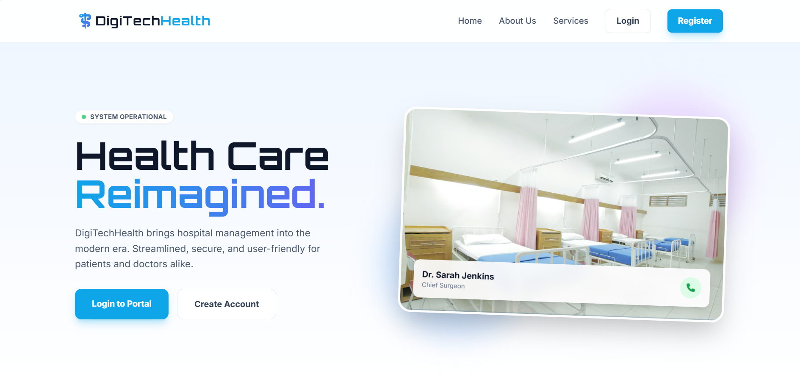
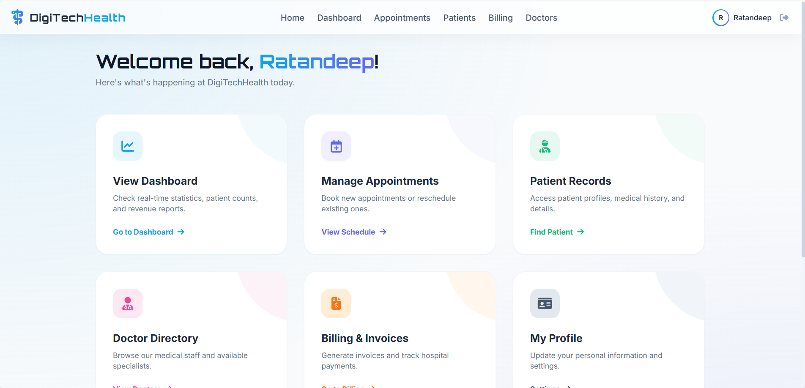
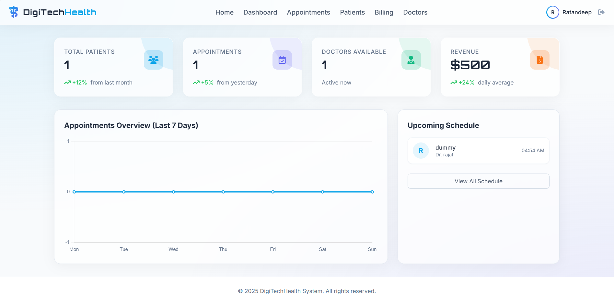
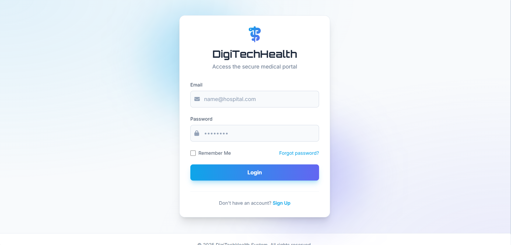

# DigiTechHealth 🏥

**Hospital Management System**  
**Creator:** Ratandeep

DigiTechHealth is a modern, web-based Hospital Management System designed to streamline healthcare operations. It features a futuristic, light-themed user interface with glassmorphism effects, ensuring a premium user experience for doctors, patients, and administrators.



---

## 🚀 Features

*   **Modern UI/UX**: Fully responsive Light Theme with Sky Blue & Indigo accents, glassmorphism cards, and smooth animations.
*   **Role-Based Access**: Secure login and registration for Patients and Doctors.
*   **Dashboard**: Real-time overview of Patients, Appointments, Active Doctors, and Revenue.
*   **Patient Management**: Create, Read, Update, and Delete (CRUD) patient records with medical history.
*   **Doctor Directory**: View available specialists and their schedules.
*   **Appointment Scheduling**: Book appointments with doctors and track their status.
*   **Billing System**: Generate and view invoices for patient treatments.
*   **Real-time Stats**: Live updates on the dashboard without page reloads.

---

## 🛠️ Tech Stack

*   **Backend**: Python, Flask
*   **Database**: SQLite (via SQLAlchemy)
*   **Frontend**: HTML5, Tailwind CSS (CDN), Vanilla JavaScript
*   **Authentication**: Flask-Login
*   **Forms**: Flask-WTF

---

## 📦 Installation & Setup

Follow these steps to run the project locally on your machine.

### Prerequisites
*   Python 3.8 or higher installed.

### 1. Clone or Download
Navigate to the project directory.
```bash
cd path/to/DigiTechHealth
```

### 2. Create a Virtual Environment
It is recommended to use a virtual environment.
```bash
# Windows
python -m venv .venv
.venv\Scripts\activate

# Mac/Linux
python3 -m venv .venv
source .venv/bin/activate
```

### 3. Install Dependencies
Install the required Python packages.
```bash
pip install -r requirements.txt
```

### 4. Initialize the Database
Set up the SQLite database and tables.
```bash
flask db init
flask db migrate -m "Initial migration"
flask db upgrade
```
*(Note: If the `migrations` folder already exists, you can skip `flask db init` and just run `flask db upgrade`)*

### 5. Run the Application
Start the Flask development server.
```bash
python run.py
```

### 6. Access the App
Open your web browser and go to:
[http://127.0.0.1:5000](http://127.0.0.1:5000)

---

## 📸 Screenshots

### Welcome Page

*The public landing page with login options.*

### Home Dashboard (Authenticated)

*Quick actions and real-time hospital status.*

### Stats Dashboard

*Detailed statistics and activity charts.*

### Login Screen

*Secure and beautiful login interface.*

---

## 📝 Usage Guide

1.  **Register**: Create a new account. By default, new users are **Patients**.
2.  **Add a Doctor**: 
    *   *Note: Currently, you can register a new user and assign them the 'doctor' role via the database or the "Add Doctor" form if you are an admin.*
    *   Go to **Dashboard > Doctors > Add Doctor** (if accessible) to onboard medical staff.
3.  **Book Appointment**: Go to **Appointments > New Booking**, select a doctor, and choose a time.
4.  **Manage Patients**: Go to **Patients > Add Patient** to create a medical record.
5.  **Billing**: Go to **Billing > Create Invoice** to bill a patient.

---

## 📞 Contact
**Developed by Ratandeep**  
Email: rajatpurohit183@gmail.com
Address: Dammani Chowk,Bikaner, Rajasthan

---
*© 2025 DigiTechHealth. All rights reserved.*
